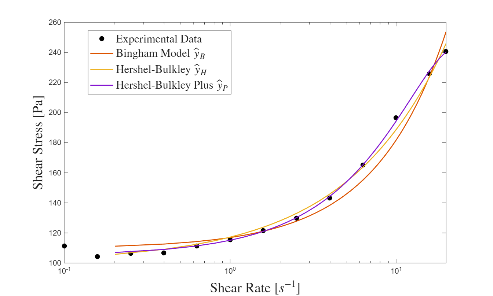

# MCEN3030 Homework 3

## Problem 1

With the given dataset "yacht_hydrodynamics.csv", a linear regression can find the best fits of the model of the form $\hat{y}=a_0 + a_1x_1 + a_2 x_2 + ... + a_6 x_6$. that regression returns:
 
| Parameter                  | Parameter Values |
|----------------------------|-----------------|
| Residuary Constant ($a_0$)        | -19.237         |
| Longitudinal position   ($a_1$)   | 0.19384         |
| Prismatic coefficient    ($a_1$)  | -6.4194         |
| Length-displacement ratio ($a_3$) | 4.233           |
| Beam-draught ratio  ($a_4$)       | -1.7657         |
| Length-beam ratio    ($a_5$)      | -4.5164         |
| Froude number       ($a_6$)       | 121.67          |

With these values, the value of $R^2$ is 0.6576. These parameter fits allow us to calculate the resistance of a "cube boat", where each value of $x_1, x_2, ... x_n =1$
For the cube boat, the predicted resistance is:
$\hat{y}_{cube} = 94.1563$
The parameter values in the table reflect the nature of the variable in increasing or decreasing the boats residual resistance. Those with a negative sign, like length-beam ratio, beam-draught ratio, and the prismatic coefficient act to decrease resistance if other variables are held constant. The other terms act to increase resistnace for a given increase in associated $x_n$. 

## Problem 2

Fitting data from "rheo_data.csv", the following plot shows the 3 models fitted to the data:

The model fits are described by:

"The Bingham Model": $\hat{y}_B = \tau_y + \eta x$, with two parameters $\tau_y = 109.7397$ and $\eta = 7.1975$.

"The Hershel-Bulkley Model": $\hat{y}_H = \tau_y + K x^n$, with three parameters $\tau_y = 100.4735$, $K = 16.7491$, and $n = 0.7214$.

"The Hershel-Bulkley Plus Model": $\hat{y}_P = \tau_y+K_1 x + K_2 x^n$ with four parameters  $\tau_y = 104.9358$, $K_1 = 10.2530$, $K_2 = -0.0509$, and $n =  2.4121$.

